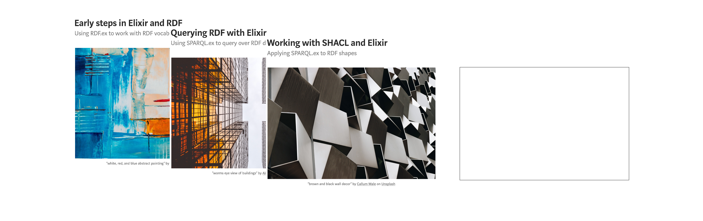

Examples
========

Code examples used in posts on Medium.com.

* "[Early steps in Elixir and RDF](https://medium.com/@tonyhammond/early-steps-in-elixir-and-rdf-5078a4ebfe0f)" ([test_vocab](./test_vocab/))
* "[Querying RDF with Elixir](https://medium.com/@tonyhammond/querying-rdf-with-elixir-2378b39d65cc)" ([test_query](./test_query/))
* "[Working with SHACL and Elixir](https://medium.com/@tonyhammond/working-with-shacl-and-elixir-4719473d43c1)" ([test_shacl](./test_shacl/))
* "[Robust compute for RDF queries](https://medium.com/@tonyhammond/robust-compute-for-rdf-queries-eb2ad665ef12)" [(test_super](./test_super/))
